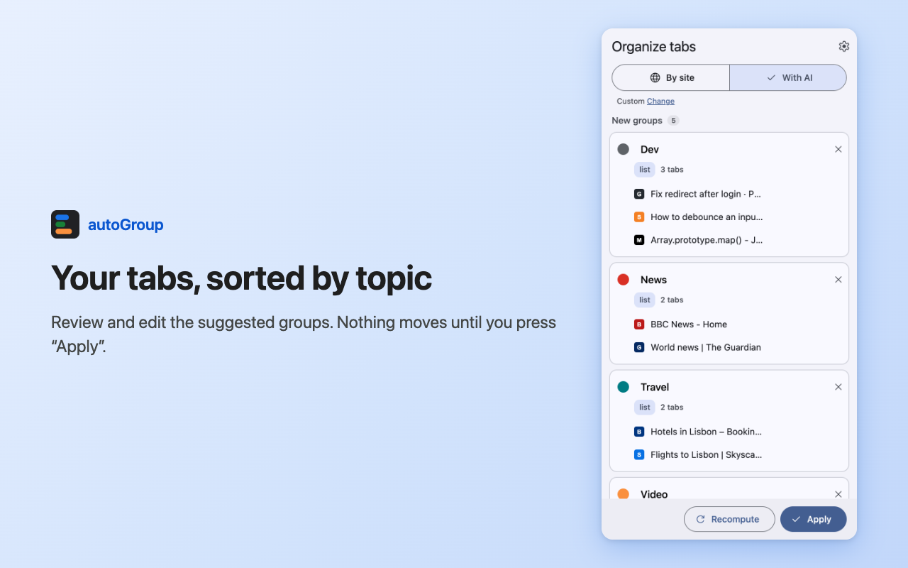

# autoGroup

A Chrome extension that sorts your tabs into groups, by site or by topic, with the AI you choose. It shows you the proposal first and doesn't move a single tab until you press **Apply**, except tabs from sites you put in a category yourself (see *Sites* in [Choosing the AI](#choosing-the-ai)).

<p align="center"></p>

- **Two modes**: *By site* (instant, no data leaves your computer) or *With AI* (tabs sorted by topic, into your categories or new groups).
- **You choose the AI**: Gemini Nano built into Chrome, a model on your computer (Ollama, LM Studio, Unsloth Studio) or an OpenAI-compatible online service (OpenRouter). Optional: a System One classifier (Jev, Kev, Rizzo Flow).
- **Editable preview** and **Undo**: rename, recolor, move or remove tabs, then apply; if you don't like the result, go back.
- **You always get a proposal**: if the AI doesn't answer, autoGroup falls back to grouping by site, which you already see while the AI is working.
- Interface in **English** and **Italian**, following Chrome's language.

<a href="https://www.buymeacoffee.com/SpatariuRares"></a>

## Installation

From the **[Chrome Web Store](https://chromewebstore.google.com/detail/gpfcmddgokgkjdeecjhgbbdcpjffcmke)**: *Add to Chrome*. Requires Chrome 116 or later.

On first run a short **guide** opens: choose the mode and, if you want AI, the provider. You can see it again from the settings (*Show the guide again*). It works right away without any setup: it uses Gemini Nano if Chrome supports it, otherwise it groups by site.

To install it from source, see [Development](#development).

## How to use it

1. Click the autoGroup icon (or press `Alt+Shift+G`): the **side panel** opens with a proposal for the current window.
2. Review the groups: you can rename them, change their color, move or remove a tab, discard a whole group, or close a tab.
3. Press **Apply**: the groups are created in Chrome.
4. If something is off, **Undo last organization** puts every tab back where it was.

The panel stays open while you browse. If your tabs change in the meantime, it tells you and offers **Recompute**. At the top of the panel you can switch between *By site* and *With AI* at any time.

**Which tabs it touches**: only the ungrouped tabs of the current window. Pinned tabs, tabs already in a group, Chrome pages and tabs from domains you exclude stay where they are. Groups you already have open are never renamed: they can only receive new tabs that belong there.

To change the shortcut, go to `chrome://extensions/shortcuts`. If another extension already uses `Alt+Shift+G`, Chrome doesn't assign it and you need to pick one there.

## Choosing the AI

The settings (⚙ in the panel) have two roles. The first one is enough.

**Generator**: puts tabs into your categories and makes up new groups when needed.

| Provider | Runs | API key | Notes |
|---|---|---|---|
| Gemini Nano | Inside Chrome | No | Default. Downloaded once from the settings, if your computer supports it |
| Ollama | On your computer | No | See [Troubleshooting](#troubleshooting) for `OLLAMA_ORIGINS` |
| LM Studio | On your computer | No | Start the local server in LM Studio |
| Unsloth Studio | On your computer | Yes | Create the key in Studio after signing in; load the model in Studio, or turn on *Model auto-switch* in Settings > API |
| OpenRouter | Online | Yes | Tab titles and addresses are sent to the service |
| Custom | Anywhere | Optional | Any server compatible with the OpenAI API |

**Classifier** (optional): puts each tab into a category in a few tenths of a second, with a confidence score; uncertain tabs go to the Generator. It works with servers that speak the System One protocol. The confidence threshold (70% by default) is set in the same section.

| Provider | Runs | API key | Notes |
|---|---|---|---|
| Jev | Online (TypeSafe) | Yes | Model `jev-latest` |
| Kev | On your computer | No | On a laptop use `kev-0.8b` (about 4 GB of memory); the default 4B model needs about 17 GB |
| Rizzo Flow | On your computer | No | The `rizzo-latest` model is required. 1.7B (about 1.8 GB) or 4B (about 4.4 GB) versions |

When you save a provider, Chrome asks for permission to contact **that server only**. **Test connection** checks the address, key and model.

**Categories**: the options the AI picks from. There are ten default categories (Work, Dev, News, Travel…) that you can edit, reorder or restore. Each one has a name, a description that tells the AI what belongs there, and a color. A group made up by the AI can be added to the list with **Save to list**.

**Sites**: each category can also have sites, such as `github.com` or `github.com/my-org`. Tabs from those sites (subdomains included) always go to that category, before any AI, also when grouping *By site*: the AI only receives the other tabs. If two sites match, the more specific one wins. In the panel, after you move a tab into a category, autoGroup offers to **always put** that site there.

**Automatic grouping**: when you open a page from one of those sites, the tab goes straight into the category's group, without AI and without opening the panel. If the group isn't open yet, it's created once the category has the minimum number of tabs. It only happens when a tab changes address, so a tab you take out of a group by hand stays out until it opens another page. You can turn it off in *Settings > Categories and sites*.

**If the AI doesn't answer**: the next level takes over (Classifier → Generator → by site) and the panel shows a notice with the cause and a link to the settings. While the AI is working you already see the by-site proposal: **Use this** keeps it without waiting.

## Troubleshooting

**Ollama says "invalid API key".** Ollama rejects requests coming from an extension. Start it allowing them:

```bash
OLLAMA_ORIGINS="chrome-extension://*" ollama serve
# macOS app: launchctl setenv OLLAMA_ORIGINS "chrome-extension://*" and restart Ollama
```

**Gemini Nano is "not supported".** You need a recent Chrome and a computer that meets Google's requirements (disk space, GPU or memory). If it "needs to be downloaded" (about 2–4 GB), start the download from the Generator section. Nano only answers in German, English, Spanish, French and Japanese: with Chrome in another language, the groups it makes up get English names.

**"Did not answer in time" with a local model.** Each Generator request has 30 seconds. A small model that "reasons" may not be enough with many tabs: try fewer tabs, a faster model, or add a Classifier, which leaves only the uncertain tabs to the Generator.

**"Rejected the request".** Usually the model name is wrong: check it in the settings and use **Test connection**.

**OpenRouter has `typesafe/jev-router`: is that Jev?** No: it is a router that forwards each request to a different model, with no calibrated confidence. The Jev classifier is only available from TypeSafe's API.

## Privacy

- autoGroup has **no servers of its own**: the developer receives no data and no analytics.
- In *By site* mode, and with Gemini Nano or a provider on your computer, **no data leaves your computer**.
- An online provider only receives the **title** and **cleaned address** of your tabs (domain and path, no parameters), never pinned tabs, grouped tabs or tabs from the **excluded domains** you set in the settings.
- Reading **page descriptions** is optional: it asks for permission only when you turn it on and removes it when you turn it off. It only reads the meta description, never the page content, and never wakes sleeping tabs.
- **API keys** stay on this computer and are never synced.

Full policy: [docs/store/privacy.md](docs/store/privacy.md).

### Permissions

| Permission | Why |
|---|---|
| `tabs`, `tabGroups` | Read the titles and addresses of your tabs, create groups, move and close tabs when you ask, and put a tab into its category's group when it opens one of your category sites (automatic grouping, can be turned off) |
| `storage` | Save settings, keys and the current proposal |
| `scripting` | Read page descriptions, only if you turn the option on |
| `sidePanel` | Show autoGroup in the side panel |
| Provider hosts, `<all_urls>` | Optional, requested only when you save a provider or turn on page descriptions |

## What it doesn't do (yet)

- Group new tabs on its own by topic while you browse: automatic grouping only covers the sites of your categories.
- Reorganize tabs that are already grouped.
- Work across several windows at once.
- Drag and drop tabs in the preview.

## Development

Requires Node.js 20 or later.

```bash
npm install
npm run build        # creates .output/chrome-mv3
```

Then open `chrome://extensions`, turn on **Developer mode**, choose **Load unpacked** and select `.output/chrome-mv3`.

| Command | What it does |
|---|---|
| `npm run dev` | Opens Chrome with the extension and reloads it on every change |
| `npm run check` | Type check, tests (Vitest) and build |
| `npm run smoke` | Full run in Chrome for Testing with Puppeteer and fake AI providers |
| `npm run store-assets` | Screenshots and images for the Chrome Web Store |
| `npm run zip` | Zip to upload to the store |

Built with [WXT](https://wxt.dev), TypeScript and React, with a Material Design 3 interface. Technical documentation (architecture, tests, performance, publishing) is in [`docs/`](docs/README.md).
